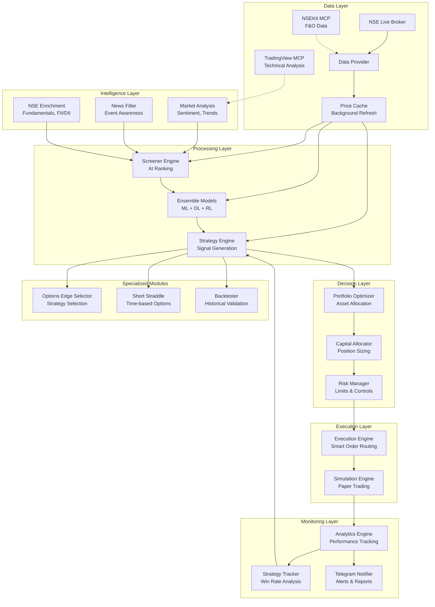
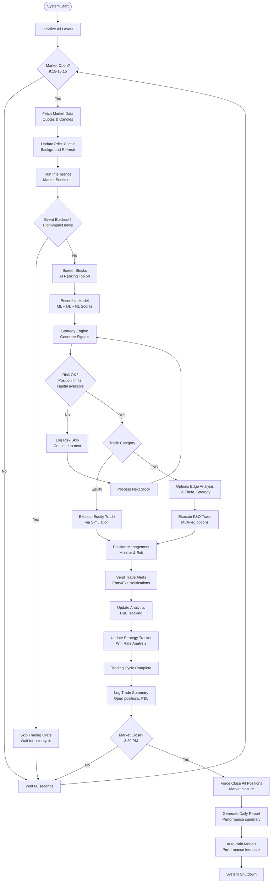
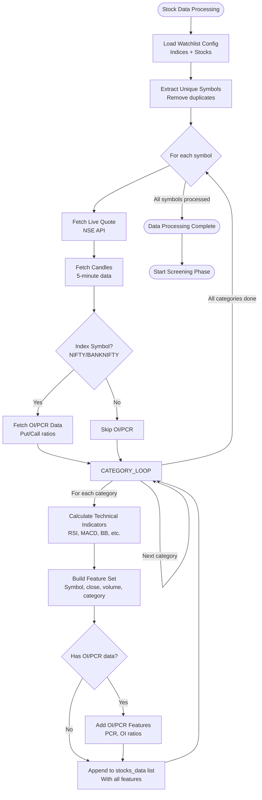
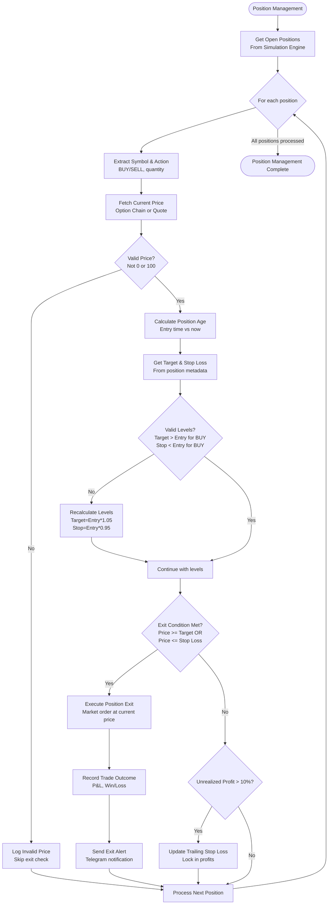
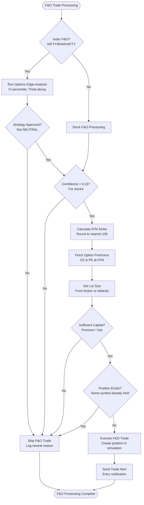

# Quant Trading Bot Architecture Flowchart

## Overall System Architecture

## Main Trading Loop Flowchart

## Data Processing Flowchart

## Position Management Flowchart

## F&O Processing Flowchart

## Key Components Legend

### Data Sources
- **NSE Live Broker**: Real-time market data
- **NSEKit MCP**: F&O chain data, expiry dates
- **TradingView MCP**: Technical analysis, backtesting
- **NSE Enrichment**: Fundamentals, FII/DII flows

### Processing Stages
- **Intelligence**: Market sentiment, event filtering
- **Screener**: Stock selection using AI ranking
- **Models**: Ensemble of ML/DL/RL predictions
- **Strategy**: Signal generation from model scores
- **Portfolio**: Position sizing and allocation
- **Risk**: Trade limits and drawdown control
- **Execution**: Order routing and simulation
- **Analytics**: Performance tracking and reporting

### Specialized Features
- **Options Edge**: Advanced options strategy selection
- **Short Straddle**: Time-based options strategies
- **Strategy Tracker**: Performance-based strategy suppression
- **Backtester**: Historical strategy validation

### Risk Management
- **Position Limits**: Max positions, exposure limits
- **Capital Allocation**: Dynamic position sizing
- **Stop Losses**: ATR-based trailing stops
- **Drawdown Control**: Daily loss limits
- **Event Filtering**: Skip trading during high-impact events

This flowchart represents the complete architecture and flow of the Quant Trading Bot system.